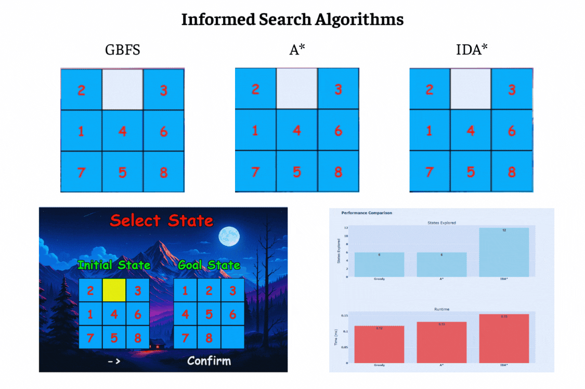

# Giới thiệu bài toán 8_puzzle
8-Puzzle Solver là một đồ án phần mềm giải bài toán 8-Puzzle (trò chơi xếp ô số 3x3) được phát triển bằng Python, sử dụng Pygame cho giao diện người dùng và Plotly để trực quan hóa hiệu suất. Chương trình tích hợp hơn 20 thuật toán tìm kiếm để giải bài toán và so sánh hiệu suất.
# 1. Mục tiêu
Mục tiêu cốt lõi của dự án là xây dựng một chương trình toàn diện và linh hoạt để giải quyết bài toán 8-puzzle – một bài toán kinh điển và nền tảng trong lĩnh vực trí tuệ nhân tạo cũng như khoa học máy tính – thông qua việc tích hợp nhiều thuật toán đa dạng và tiên tiến, từ các phương pháp tìm kiếm truyền thống đến các kỹ thuật học tăng cường hiện đại. Dự án không chỉ dừng lại ở việc tạo ra một công cụ đơn thuần để tìm lời giải cho bài toán, mà còn đặt trọng tâm vào việc thiết kế một nền tảng mạnh mẽ, hỗ trợ nghiên cứu chuyên sâu, học tập thực tiễn, và khám phá các cách tiếp cận khác nhau trong việc giải quyết các vấn đề phức tạp của trí tuệ nhân tạo, từ đó mang lại giá trị giáo dục và thực tiễn cho người dùng.
# 2. Nội dung
## 2.1 Nhóm thuật toán tìm kiếm không có thông tin (Uninformed Search Algorithms)
Các thành phần chính của bài toán tìm kiếm và giải pháp
+ Trạng thái ban đầu
  - Một lưới 3x3 với 8 số từ 1 đến 8 và một ô trống (0), đại diện cho trạng thái khởi đầu của bài toán.
+ Trạng thái mục tiêu
  - Lưới 3x3 với thứ tự số từ 1 đến 8 và ô trống ở vị trí cuối cùng ([[1 2 3], [4 5 6], [7 8 0]]).
+ Không gian trạng thái
  - Tập hợp tất cả các cấu hình có thể của lưới 3x3 hay các cách sắp xếp cụ thể vị trí các ô.
+ Hành động
  - Di chuyển ô trống lên, xuống, trái, hoặc phải để hoán đổi với ô số liền kề.
+ Chi phí
  - Mỗi bước di chuyển có chi phí bằng 1, vì bài toán ưu tiên tìm đường đi ngắn nhất.
+ Giải pháp
  - Dãy các trạng thái từ trạng thái ban đầu đến trạng thái mục tiêu, được tạo ra bởi các thuật toán tìm kiếm không có thông tin BFS, DFS, UCS, và IDS.
  
Hình ảnh gif từng thuật toán cùng biểu đồ so sánh hiệu suất

Nhận xét
+ BFS (Breadth-First Search): Hiệu quả trong việc tìm đường đi ngắn nhất nhờ khám phá theo mức độ. Tuy nhiên, BFS có thể tiêu tốn nhiều bộ nhớ, đặc biệt khi không gian trạng thái lớn, do phải lưu trữ tất cả các trạng thái ở mỗi mức.
+ DFS (Depth-First Search): Tiết kiệm bộ nhớ hơn BFS vì chỉ lưu trữ một đường đi tại một thời điểm. Tuy nhiên, DFS dễ bị đi sâu vào các nhánh không hứa hẹn, dẫn đến hiệu suất kém nếu trạng thái mục tiêu nằm ở độ sâu thấp.
+ UCS (Uniform-Cost Search): Tương tự BFS, UCS đảm bảo tìm được đường đi tối ưu. Tuy nhiên, UCS linh hoạt hơn khi chi phí các bước có thể khác nhau, mặc dù điều này không ảnh hưởng nhiều trong bài toán 8-Puzzle với chi phí đồng nhất.
+ IDS (Iterative Deepening Search): Kết hợp ưu điểm của BFS và DFS, IDS khám phá theo từng mức độ nhưng không tiêu tốn bộ nhớ như BFS. IDS thường hiệu quả hơn trong các bài toán như 8-Puzzle, đặc biệt khi cần cân bằng giữa bộ nhớ và thời gian chạy.
  
Kết luận
+ IDS thường nổi bật nhờ khả năng cân bằng giữa bộ nhớ và hiệu quả tìm kiếm, phù hợp với bài toán 8-Puzzle.
+ DFS có thể kém hiệu quả nhất trong nhóm này, do không đảm bảo tìm được đường đi ngắn nhất và dễ bị kẹt ở các nhánh sâu.

## 2.2  Nhóm thuật toán tìm kiếm có thông tin (Informed Search Algorithms)
Các thành phần chính của bài toán tìm kiếm và giải pháp
+ Trạng thái ban đầu
  - Một lưới 3x3 với 8 số từ 1 đến 8 và một ô trống (0), đại diện cho trạng thái khởi đầu của bài toán ([[2 0 3], [1 4 6], [7 5 8]]).
+ Trạng thái mục tiêu
  - Lưới 3x3 với thứ tự số từ 1 đến 8 và ô trống ở vị trí cuối cùng ([[1 2 3], [4 5 6], [7 8 0]]).
+ Không gian trạng thái
  - Tập hợp tất cả các cấu hình có thể của lưới 3x3 hay các cách sắp xếp cụ thể vị trí các ô.
+ Hành động
  - Di chuyển ô trống lên, xuống, trái, hoặc phải để hoán đổi với ô số liền kề.
+ Chi phí
  - Mỗi bước di chuyển có chi phí bằng 1, vì bài toán ưu tiên tìm đường đi ngắn nhất.
+ Giải pháp
  - Dãy các trạng thái từ trạng thái ban đầu đến trạng thái mục tiêu, được tạo ra bởi các thuật toán tìm kiếm có thông tin GBFS, A*, và IDA*.

Hình ảnh gif từng thuật toán cùng biểu đồ so sánh hiệu suất

Nhận xét
+ GBFS (Greedy Best-First Search): Nhanh và khám phá ít trạng thái nhờ chỉ tập trung vào giá trị heuristic, bỏ qua chi phí đã đi. GBFS tìm giải pháp nhanh chóng, nhưng có thể không đảm bảo đường đi ngắn nhất do dễ bị kẹt ở local optima nếu heuristic không đủ chính xác.
+ A*: Đảm bảo tìm đường đi tối ưu nhờ sử dụng hàm đánh giá f(n) = g(n) + h(n), nhưng tiêu tốn nhiều bộ nhớ hơn GBFS và IDA* do duy trì hàng đợi ưu tiên lớn. Với trạng thái này, A* hoạt động ổn định, khám phá số trạng thái trung bình và tìm được đường đi tối ưu, nhưng thời gian chạy lâu hơn GBFS và IDA*.
+ IDA (Iterative Deepening A Star)*: Kết hợp ưu điểm của A* và tìm kiếm theo độ sâu, IDA* tiết kiệm bộ nhớ và chạy rất nhanh nhờ không lưu trữ hàng đợi lớn. Tuy nhiên, IDA* khám phá nhiều trạng thái nhất do cơ chế lặp lại khiến nó phải quay lại các trạng thái đã khám phá ở các lần lặp trước, đặc biệt nếu heuristic không tối ưu.

Kết luận
+ IDA* nổi bật về tốc độ và tiết kiệm bộ nhớ, nhưng số trạng thái khám phá cao hơn dự kiến cho thấy cần cải thiện heuristic để giảm số lần lặp.
+ GBFS phù hợp khi ưu tiên tốc độ, nhưng không đảm bảo đường đi tối ưu, trong khi A* là lựa chọn tốt nhất nếu cần đảm bảo tính tối ưu và sẵn sàng đánh đổi về tài nguyên.

## 2.3 Nhóm thuật toán tìm kiếm cục bộ (Local Optimization Algorithms)
Các thành phần chính của bài toán tìm kiếm và giải pháp
+ Trạng thái ban đầu
  - Một lưới 3x3 với 8 số từ 1 đến 8 và một ô trống (0), đại diện cho trạng thái khởi đầu của bài toán ([[1, 3, 6], [4, 2, 0], [7, 5, 8]]).
+ Trạng thái mục tiêu
  - Lưới 3x3 với thứ tự số từ 1 đến 8 và ô trống ở vị trí cuối cùng ([[1 2 3], [4 5 6], [7 8 0]]).
+ Không gian trạng thái
  - Tập hợp tất cả các cấu hình có thể của lưới 3x3 hay các cách sắp xếp cụ thể vị trí các ô.
+ Hành động
  - Di chuyển ô trống lên, xuống, trái, hoặc phải để hoán đổi với ô số liền kề.
+ Chi phí
  - Mỗi bước di chuyển có chi phí bằng 1, vì bài toán ưu tiên tìm đường đi ngắn nhất.
+ Giải pháp
  - Dãy các trạng thái từ trạng thái ban đầu đến trạng thái mục tiêu, được tạo ra bởi các thuật toán tìm kiếm cục bộ Simple Hill Climbing (SHC), Steepest Ascent Hill Climbing (SAHC), Random Hill Climbing (RHC), Simulated Annealing (SA), Beam Search (BS), và Genetic Algorithm (GA).

Hình ảnh gif từng thuật toán cùng biểu đồ so sánh hiệu suất

Nhận xét
+ Simple Hill Climbing (SHC): Nhanh nhất trong nhóm nhờ chọn trạng thái lân cận đầu tiên tốt hơn và dừng sớm khi mắc kẹt ở cực trị cục bộ. SHC có thời gian chạy thấp nhất nhưng chỉ khám phá rất ít trạng thái, dễ bỏ sót giải pháp tối ưu do không có cơ chế thoát cực trị cục bộ.
+ Steepest Ascent Hill Climbing (SAHC): Chậm hơn SHC vì phải duyệt hết tất cả lân cận để chọn trạng thái tốt nhất mỗi bước, dẫn đến khám phá nhiều trạng thái hơn SHC. Trong biểu đồ, SAHC có thời gian chạy cao hơn SHC và RHC, nhưng vẫn nhanh hơn các thuật toán khác trong nhóm, phù hợp với lý thuyết.
+ Random Hill Climbing (RHC): Thời gian chạy trung bình trong nhóm Hill Climbing, vì chỉ chọn ngẫu nhiên một trạng thái lân cận tốt hơn thay vì duyệt hết như SAHC. RHC khám phá số trạng thái trung bình, nhiều hơn SHC nhưng ít hơn SAHC, phản ánh đúng đặc điểm lý thuyết.
+ Simulated Annealing (SA): Chậm hơn nhóm Hill Climbing nhưng nhanh hơn GA, nhờ cơ chế làm nguội nhiệt độ và khả năng chấp nhận trạng thái tệ hơn với xác suất giảm dần. Với trạng thái này, SA khám phá nhiều trạng thái hơn HC và BS, nhưng ít hơn GA, phù hợp lý thuyết do lặp lâu để thoát cực trị cục bộ.
+ Beam Search (BS): Thời gian chạy trung bình, nhanh hơn SA và GA nhờ giới hạn số trạng thái mỗi bước (beam_width=5). BS khám phá ít trạng thái hơn SA và GA, nhưng nhiều hơn HC, phản ánh đúng đặc điểm lý thuyết về cân bằng giữa thời gian và không gian.
+ Genetic Algorithm (GA): Chậm nhất và khám phá nhiều trạng thái nhất, do lặp qua nhiều thế hệ, với quần thể lớn. Điều này giúp GA có khả năng tìm giải pháp tối ưu hơn HC, nhưng tốn tài nguyên, đúng với lý thuyết.

Kết luận
+ GA hiệu quả trong việc khám phá không gian trạng thái rộng, nhưng tốn nhiều thời gian và bộ nhớ, phù hợp khi cần tìm giải pháp tối ưu mà các thuật toán khác không đạt được.
+ SA là lựa chọn cân bằng, với khả năng thoát cực trị cục bộ, phù hợp cho bài toán 8-Puzzle khi cần hiệu suất tốt hơn HC.
+ BS nhanh hơn SA và GA, nhưng có thể bỏ sót giải pháp nếu beam_width quá nhỏ.
+ Nhóm HC (SHC, SAHC, RHC) nhanh và tiết kiệm tài nguyên, nhưng dễ mắc kẹt ở cực trị cục bộ, trong đó SHC nhanh nhất nhưng kém hiệu quả nhất về khả năng tìm giải pháp tối ưu.

## 2.4 Nhóm thuật toán tìm kiếm trong môi trường phức tạp (Search in complex environments)
Các thành phần chính của bài toán tìm kiếm và giải pháp
+ Trạng thái ban đầu
  - Đối với AND-OR Search: Một lưới 3x3 cụ thể với 8 số từ 1 đến 8 và một ô trống (0), đại diện cho trạng thái khởi đầu (ví dụ: [[1, 2, 3], [4, 5, 6], [7, 0, 8]]).
  - Đối với Belief State Search: Một tập belief states bao gồm trạng thái ban đầu và 2 trạng thái lân cận được tạo ra bằng cách hoán đổi ô trống với các ô liền kề hợp lệ, mô phỏng môi trường mù hoàn toàn.
  - Đối với Partial Observable Search (POS): Một tập belief states bao gồm các trạng thái có số 1 ở vị trí (0,0) (do quan sát một phần), được tạo từ trạng thái ban đầu và các trạng thái lân cận hợp lệ.
+ Trạng thái mục tiêu
  - Lưới 3x3 với thứ tự số từ 1 đến 8 và ô trống ở vị trí cuối cùng ([[1 2 3], [4 5 6], [7 8 0]]).
+ Không gian trạng thái
  - Tập hợp tất cả các cấu hình có thể của lưới 3x3, bao gồm các trạng thái xác định và không xác định (do hoán đổi ô trống với các ô liền kề hợp lệ).
+ Hành động
  - Di chuyển ô trống lên, xuống, trái, hoặc phải để hoán đổi với ô số liền kề. Các thuật toán trong nhóm này còn mô phỏng không xác định bằng cách hoán đổi ô trống với các ô liền kề hợp lệ.
+ Chi phí
  - Mỗi bước di chuyển có chi phí bằng 1, vì bài toán ưu tiên tìm đường đi ngắn nhất.
+ Giải pháp
  - Dãy các trạng thái từ trạng thái ban đầu đến trạng thái mục tiêu, được tạo ra bởi các thuật toán AND-OR Search, Belief State Search, và Partial Observable Search (POS). Các thuật toán này duy trì tập belief states (tập hợp trạng thái có thể) và tìm kiếm đường dẫn để tất cả trạng thái trong belief state đạt mục tiêu.

Hình ảnh gif từng thuật toán cùng biểu đồ so sánh hiệu suất

Nhận xét
+ AND-OR Search hoạt động trong môi trường không xác định. Thuật toán không thu hẹp nhánh AND, dẫn đến không gian trạng thái lớn nhất. Tuy nhiên, thời gian chạy thấp do chi phí xử lý mỗi trạng thái thấp: không gọi hàm heuristic để thu hẹp, chỉ thực hiện các thao tác đơn giản như kiểm tra mục tiêu và hoán đổi ô trống.
+ Belief State Search hoạt động trong môi trường mù hoàn toàn, tạo trạng thái không xác định với xác suất. Thuật toán thu hẹp belief state (giữ 3 trạng thái tốt nhất theo heuristic), làm giảm không gian trạng thái so với AND-OR Search. Tuy nhiên, việc gọi hàm heuristic nhiều lần để thu hẹp belief state làm tăng chi phí xử lý mỗi trạng thái, dẫn đến thời gian chạy cao hơn.
+ POS hoạt động trong môi trường quan sát một phần (vị trí số 1 ở (0,0)), tạo trạng thái không xác định với xác suất, và thu hẹp belief state (giữ 3 trạng thái tốt nhất). Quan sát giúp loại bỏ sớm các trạng thái không phù hợp, làm không gian trạng thái nhỏ nhất. Thời gian chạy trung bình do chi phí xử lý mỗi trạng thái cao: gọi hàm heuristic để thu hẹp belief state và kiểm tra quan sát. Số bước trung bình, phản ánh khả năng tập trung vào mục tiêu nhờ quan sát.

Kết luận
+ POS là lựa chọn tốt nhất trong nhóm khi cần cân bằng giữa thời gian chạy và không gian trạng thái, nhờ quan sát giúp loại bỏ trạng thái không phù hợp và thu hẹp belief state hiệu quả.
+ Belief State Search phù hợp khi không có thông tin quan sát, nhưng chậm hơn do chi phí xử lý cao và không gian trạng thái lớn hơn POS.
+ AND-OR Search nhanh nhất nhưng tốn nhiều không gian trạng thái nhất, phù hợp khi trạng thái ban đầu gần mục tiêu, nhưng có thể không hiệu quả trong các trường hợp phức tạp do không thu hẹp nhánh AND.
  
## 2.5 Nhóm thuật toán tìm kiếm thỏa ràng buộc (Constraint Satisfaction Problem)
Các thành phần chính của bài toán tìm kiếm và giải pháp
+ Trạng thái ban đầu
  - Một lưới 3x3 rỗng, nơi tất cả các ô ban đầu là None ([[None, None, None], [None, None, None], [None, None, None]]). Mục tiêu là gán các giá trị từ 0 đến 8 vào lưới sao cho thỏa mãn các ràng buộc.
+ Trạng thái mục tiêu
  - Lưới 3x3 với thứ tự số từ 1 đến 8 và ô trống ở vị trí cuối cùng ([[1 2 3], [4 5 6], [7 8 0]]).
+ Không gian trạng thái
  - Tập hợp tất cả các cấu hình có thể của lưới 3x3 khi gán giá trị từ 0 đến 8, với các ràng buộc:
    * Ô (0,0) phải là 1.
    * Mỗi số từ 0 đến 8 chỉ xuất hiện một lần.
    * Ràng buộc hàng: Ô (i,j+1) = ô(i,j) + 1 (trừ ô trống).
    * Ràng buộc cột: Ô (i+1,j) = ô(i,j) + 3 (trừ ô trống).
    * Trạng thái phải có thể giải được (số nghịch đảo chẵn).
+ Hành động
  - Gán giá trị từ 0 đến 8 vào các ô chưa gán, đảm bảo thỏa mãn các ràng buộc. Các thuật toán trong nhóm này sử dụng các chiến lược như Backtracking, Forward Checking, và Min-Conflicts để tìm giải pháp.
+ Chi phí
  - Mỗi bước gán giá trị có chi phí bằng 1. Bài toán ưu tiên tìm trạng thái thỏa mãn tất cả ràng buộc với số bước tối thiểu.
+ Giải pháp
  - Dãy các trạng thái từ trạng thái rỗng đến trạng thái mục tiêu, được tạo ra bởi các thuật toán Backtracking Search, Forward Checking Search, và Min-Conflicts Search. Các thuật toán này đảm bảo trạng thái cuối cùng thỏa mãn tất cả ràng buộc và khớp với mục tiêu.

Hình ảnh gif từng thuật toán cùng biểu đồ so sánh hiệu suất

Nhận xét
+ Backtracking Search: Thuật toán duyệt không gian tìm kiếm theo chiều sâu, kiểm tra ràng buộc và quay lui khi cần. Do không có cơ chế tối ưu hóa như MRV hay LCV, số trạng thái khám phá cao, nhưng chi phí mỗi bước thấp, dẫn đến thời gian chạy nhanh nhất trong nhóm. Phù hợp khi trạng thái ban đầu đơn giản, nhưng không hiệu quả với bài toán phức tạp do không gian tìm kiếm lớn.
+ Forward Checking Search: Thuật toán sử dụng Forward Checking để thu hẹp domain sau mỗi lần gán, cùng với MRV (chọn ô có ít giá trị hợp lệ nhất) và LCV (chọn giá trị ít loại trừ nhất). Số trạng thái khám phá thấp hơn Backtracking nhờ cơ chế thu hẹp domain, nhưng thời gian chạy cao nhất do chi phí mỗi bước lớn. Phù hợp khi cần giảm không gian tìm kiếm, nhưng cần tối ưu chi phí tính toán.
+ Min-Conflicts Search: Thuật toán bắt đầu từ trạng thái rỗng, gán giá trị và điều chỉnh để giảm xung đột, sử dụng Simulated Annealing để tránh cực trị địa phương. Số trạng thái khám phá thấp nhất nhờ chiến lược sửa lỗi từng bước, nhưng chi phí mỗi bước cao do tính toán xung đột. Thời gian chạy nằm giữa Backtracking và Forward Checking, phản ánh sự cân bằng giữa không gian và chi phí xử lý. Phù hợp khi trạng thái ban đầu gần mục tiêu.

Kết luận:
+ Min-Conflicts Search là lựa chọn tốt nhất trong nhóm về không gian trạng thái, với thời gian chạy hợp lý. Nó hiệu quả khi trạng thái ban đầu gần mục tiêu, nhờ khả năng sửa lỗi từng bước.
+ Backtracking Search nhanh nhất, nhưng tốn nhiều không gian trạng thái, phù hợp khi cần giải nhanh và không gian tìm kiếm không quá lớn.
+ Forward Checking Search hiệu quả về không gian, nhưng thời gian chạy cao do chi phí tính toán lớn. Cần tối ưu chi phí mỗi bước để cạnh tranh hơn, nhưng vẫn là lựa chọn tốt khi ưu tiên giảm không gian tìm kiếm.

## 2.6 Nhóm thuật toán học tăng cường (Reinforcement Learning)
Các thành phần chính của bài toán tìm kiếm và giải pháp
+ Trạng thái ban đầu
  - Một lưới 3x3 với 8 số từ 1 đến 8 và một ô trống (0), đại diện cho trạng thái khởi đầu của bài toán (ví dụ: [[4, 1, 3], [7, 2, 6], [0, 5, 8]]).
+ Trạng thái mục tiêu
  - Lưới 3x3 với thứ tự số từ 1 đến 8 và ô trống ở vị trí cuối cùng ([[1 2 3], [4 5 6], [7 8 0]]).
+ Không gian trạng thái
  - Tập hợp tất cả các cấu hình có thể của lưới 3x3, được tạo ra bằng cách hoán đổi ô trống với các ô liền kề hợp lệ. Thuật toán Q-Learning học chính sách tối ưu thông qua việc khám phá không gian trạng thái này.
+ Hành động
  - Di chuyển ô trống lên, xuống, trái, hoặc phải để hoán đổi với ô số liền kề. Có 4 hành động tương ứng: 0 (trái), 1 (phải), 2 (xuống), 3 (lên).
+ Chi phí
  - Mỗi bước di chuyển có chi phí là 1, vì bài toán tập trung tìm đường đi ngắn nhất từ trạng thái ban đầu đến trạng thái mục tiêu.
+ Giải pháp
  - Một dãy các trạng thái từ trạng thái ban đầu đến trạng thái mục tiêu, được tạo ra bởi thuật toán Q-Learning. Thuật toán học chính sách tối ưu bằng cách cập nhật bảng Q (Q-table) dựa trên phần thưởng, sau đó trích xuất đường đi từ bảng Q đã học.

Hình ảnh gif từng thuật toán cùng biểu đồ so sánh hiệu suất

Nhận xét
+ Q-Learning: Thuật toán sử dụng chiến lược Epsilon-Greedy để cân bằng giữa khám phá và khai thác, cập nhật bảng Q dựa trên phần thưởng. Số trạng thái khám phá cao do Q-Learning cần thăm nhiều trạng thái trong quá trình học để xây dựng chính sách tối ưu. Thời gian chạy tương đối cao vì số lượng trạng thái lớn và chi phí tính toán mỗi bước bao gồm cập nhật Q-value, tính phần thưởng, và kiểm tra trạng thái lân cận. Tuy nhiên, Q-Learning đảm bảo hội tụ về chính sách tối ưu nếu có đủ thời gian học, phù hợp khi cần học chính sách dài hạn trong môi trường không xác định.

Kết luận:
+ Q-Learning là lựa chọn phù hợp trong nhóm học tăng cường cho bài toán 8-Puzzle khi cần học chính sách tối ưu mà không yêu cầu mô hình môi trường. Tuy nhiên, số trạng thái khám phá lớn và thời gian chạy cao, cho thấy nó kém hiệu quả hơn so với các thuật toán tìm kiếm khác về mặt không gian và thời gian.

# 3. Tác giả
Dự án được thực hiện bởi:

## Sinh Viên: Đào Minh Nhựt - 23110282

Dự án này là đồ án cá nhân phục vụ việc học tập, đồng thời nhằm mục đích nghiên cứu và ứng dụng các thuật toán tìm kiếm AI vào bài toán 8-Puzzle, với trọng tâm là tối ưu hóa hiệu suất và trải nghiệm người dùng.

# 4. Tài liệu tham khảo
....
